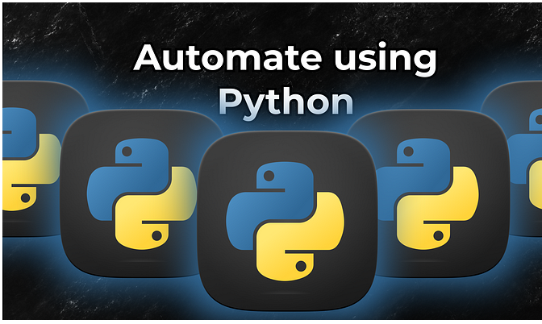
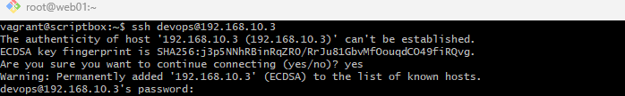
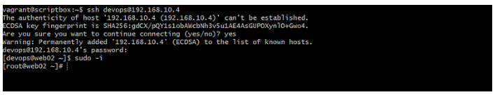
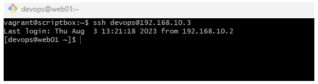
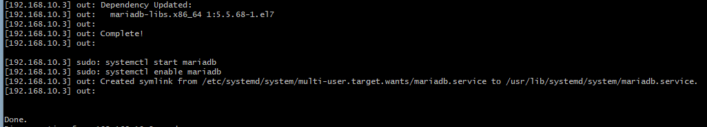

# Project-8: AUTOMATE USING PYTHON -Remotely

[*Project Source*](https://www.udemy.com/course/decodingdevops/learn/lecture/26465840#questions)

- Using python(Fabric) to automate operating systems task especially Linux



## TASKS
* SSH in python
* Fabric
* Webserver provisioning with python fabric
* Python virtual environment

## Step-1: Install Fabric

- Install Fabric 
- Before Fabric installation, first we install pip by using the below commands to download the script.
```sh
wget https://bootstrap.pypa.io/get-pip.py
ls
apt install python
ls
python get-pip.py
pip install python-jenkins
```

- Next, Install Fabric and create a directory for fabric using the below commands
```sh
pip install 'fabric<2.0'
mkdir fabric
cd fabric/
vim fabfile.py
```

## Step-2: Create file 
- create a file for fabric using the below command
```sh
vim fabfile.py
```

- Insert the below python function into the file
```sh
def greeting(msg):
    print "Good %s" % msg
```

- Now, let's call the python function from the shell with the below commands
```sh
fab -l
fab greeting:Evening
```


## Step-3: Execute system commands

- Execute system commands using fabrics with the below scripts
```sh
vim fabfile.py
```
```sh
from fabric.api import *

def greeting(msg):
    print "Good %s" % msg

def system_info():
    print "Disk Space"
    local("df -h")

    print "RAM size"
    local("free -m")

    print "System uptime."
    local("uptime")
```


- Execute tasks on remote machine using fabrics with the below scripts
```sh
vim fabfile.py
```
```sh
from fabric.api import *

def greeting(msg):
    print "Good %s" % msg

def system_info():
    print "Disk Space"
    local("df -h")

    print "RAM size"
    local("free -m")

    print "System uptime."
    local("uptime")

def remote_exec():
    print "Get System Info"
    run("hostname")
    run("uptime")
    run("df -h")
    run("free -m")
```

- SSH into `web01` and add user `Devops`
```sh
vagrant ssh web01
sudo -i
useradd devops
passwd devops
```

- Add the users into the sudo file to enable root privilege
```sh
visudo

/root
devops ALL=(ALL)   NOPASSWD:ALL
```
- Add a configuration file using the below command and enable password login
```sh
vi /etc/ssh/sshd_config 

/password
PasswordAuthentication yes
systemctl restart ssh
```

- SSH into `web02` and add user `devops`
```sh
vagrant ssh web02
sudo -i
useradd devops
passwd devops
```

- Add the users into the sudo file to enable root privilege
```sh
visudo

/root
devops ALL=(ALL)   NOPASSWD:ALL
```

- Add a configuration file using the below command and enable password login
```sh
vi /etc/ssh/sshd_config 

/password
PasswordAuthentication yes
systemctl restart sshd
```

## Step-4: Execute system commands for password base login

- Execute system machine one after the other 
- For web01, login to scriptbox

```sh
vagrant ssh scriptbox
sudo -i
ssh devops@< web01 Ip in the vagrantfile >
password:
```


- For web02, login to scriptbox
```sh
vagrant ssh scriptbox
sudo -i
ssh devops@<web02 Ip in the vagrantfile>
password:
```



## Step-5: Generate SSH keys, public & private key.
- Generate the the SSH keys, public and private key, then copy the SSH key to the user devops
```sh
ssh-keygen
```


- Copy the SSH key to the user devops `web01` using the below command
```sh
ssh-copy-id devops@serverweb01
```


- Copy the SSH key to the user devops `web02` using the below command
```sh
ssh-copy-id devops@serverweb02
```


## Step-6: Login to the machines without password
- Login web01 in using the below command
```sh
ssh devops@web01server
```


- Login web02  in using the below command
```sh
Login web02  in using the below command
```


## Step-7: Navigate to the fabric file as a root user
- Navigate to the fab file using the below command then run the remote exec function
```sh
sudo -i
cd /opt/
ls
cd pyscripts/
ls
cd fabric/
ls
fab -l
fab -H <web01 IP> -u devops remote_exec
```


- Escalate the privilege by running the below commands in the fabfile
```sh
vim fabfile.py

sudo("yum install mariadb-server -y")
sudo("systemctl start mariadb")
sudo("systemctl enable mariadb")

fab -H <web01 IP> -u devops remote_exec
```



## Step-8: Setup a web service using the fabric

- Setup a website using the fabric by running the below commands in the fabfile

```sh
vim fabfile.py

def web_setup(WEBURL, DIRNAME):
    print "#########################################################"
    local("apt install zip unzip -y")

    print "#########################################################"
    print "Installing dependencies"
    print "#########################################################"
    sudo("yum install httpd wget unzip -y")

    print "#########################################################"
    print "Start & enable service."
    print "#########################################################"
    sudo("systemctl start httpd")
    sudo("systemctl enable httpd")

    print "#########################################################"
    print "Downloading and pushing website to webservers."
    print "#########################################################"
    local(("wget -0 website.zip %s") % WEBURL)
    local("unzip -0 website.zip")

    with lcd(DIRNAME):
        local("zip -r tooplate.zip * ")
        put("tooplate.zip", "/var/www/html/", use_sudo=True)

    with cd ("/var/www/html/"):
       sudo("unzip tooplate.zip"")

    sudo("systemctl restart httpd")

    print "Website setup is done."
```

- Download a website template from tooplate.com and copy the link, then run the below command 
- For web01: 
```sh
fab -l

fab -H 192.168.10.3 -u devops web_setup:https://www.tooplate.com/zip-templates/2121_wavecafe.zip,<DIRNAME>
```


- For web02: 
```sh
fab -l

fab -H 192.168.10.4 -u devops web_setup:https://www.tooplate.com/zip-templates/2119_gymso_fitness.zip,<DIRNAME>
```


## Step-9: Virtual environment
- Create a virtual environment and install all  libraries using the below commands
```sh
pip install virtualenv
virtualenv automation-env
ls
cd automation-env/
ls
```
- Activate the virtual environment using the below command
```sh
source bin/activate
```

- To deactivate the virtual environment
```sh
deactivate
```

## Step-10: Clean Up

